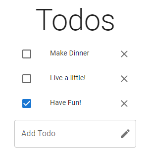
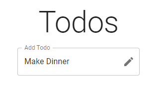
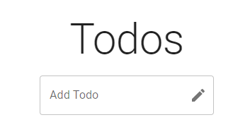

# Todo List React Application
A simple, minimalist React web application built for organising your daily tasks.

The project was set up using Vite. Vite is a fast, modern local development server for React (and more, including Vue or Svelte) apps. The app was built using the free and open-source front-end React, JavaScript library for building user interfaces based on components. Material UI, a React components library, was also used to provide good looking, easy to use, pre-built components to speed up the frontend development process.

The application uses the browser's built in local storage, so you do not lose your todos after refreshing the page.

This document outlines the project design and how to get a copy of the application running on your local machine.

## 🖼️ Project Images

<p align="center">
    
</p>
<p>The todo list application with some todos</p>

<details>
<summary>See More Images</summary>
<br>
<p align="center">
    
</p>
<p>Adding a new todo</p>
<p align="center">
    
</p>
<p>Cleared todo list page (This is the way the page looks after the application is first opened)</p>
</details>

## 🏁 Getting Started
These instructions will get you a copy of the project up and running on your local machine for development and testing purposes.

### Prerequisites
You must have node, npm and a browser installed to run the project. 

Clone the project onto your machine using git, then install the required dependencies using:
```
npm install 
```

### Running the project

The project should now be set up. To launch the app simply run:
```
npm run dev
```

Then open the app in the browser using `localhost` as per the port number given by Vite in the terminal.

## ⛏️ Built With

- [Vite](https://vitejs.dev/)
- [React](https://react.dev/)
- [Material UI](https://mui.com/)

## ✍️ Author

- [JakubRichardson](https://github.com/JakubRichardson)